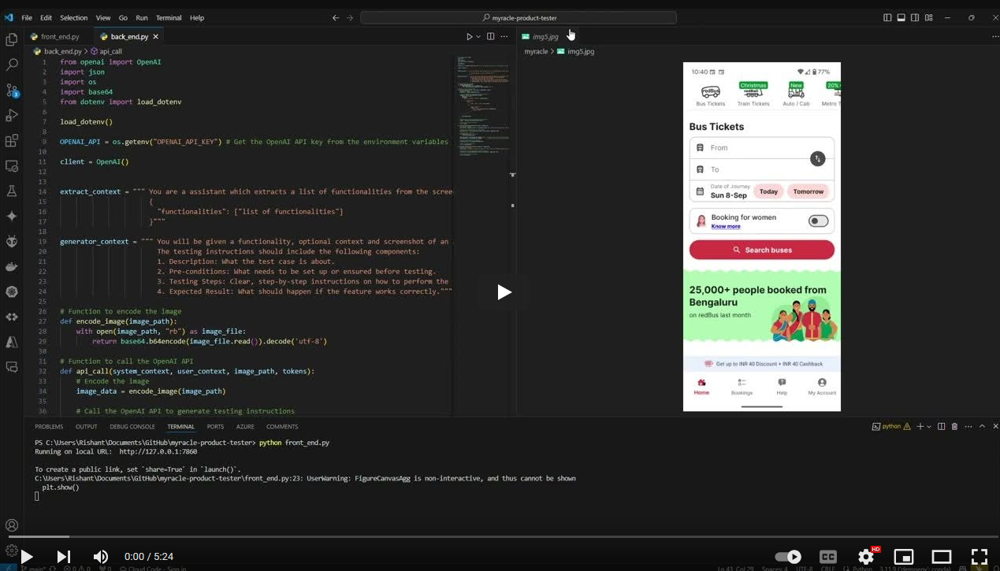
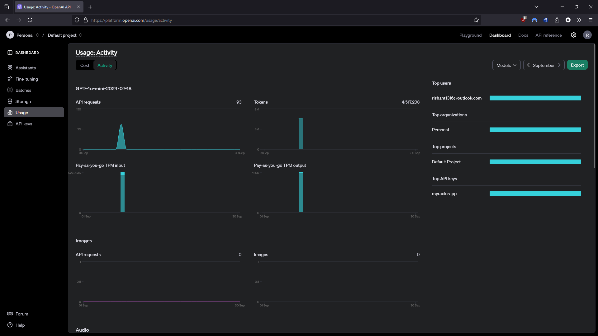

# myracle-product-tester
A tool that uses a multimodal LLM to describe testing instructions for any digital product's features, based on the screenshots.

## Demo Video
[](https://youtu.be/qOaLPHgWFhQ?si=13gHNWVis3m1z-rR)

## Prompting Strategy
1. Split complex tasks into simpler subtasks: The task on its own requires several steps, which can mainly be divided into Finding what the functionalities in eah image are and writing the testing instructions for the functionalities.
2. Personas: The model or the 'system' was specifically given specific contexts to follow for each major task, which allowed for consistent output of JSON Formats and Instructions for all images and functionalities.
3. Specifying Steps: The instruction generation context clearly defined the steps involved using delimiters and steps.

## Screenshots



## Install Instructions
1. Download conda at: [Anaconda Website](https://www.anaconda.com/download)
2. Create an environment: 
```bash 
conda create -n myenv python=3.11
```
3. Activate environment: 
```bash 
conda activate myenv
```
4. Use pip to install required libraries: 
```bash 
pip install -r requirements.txt
```
5. Clone the repo
6. Run the code: 
```bash 
python front_end.py
```
